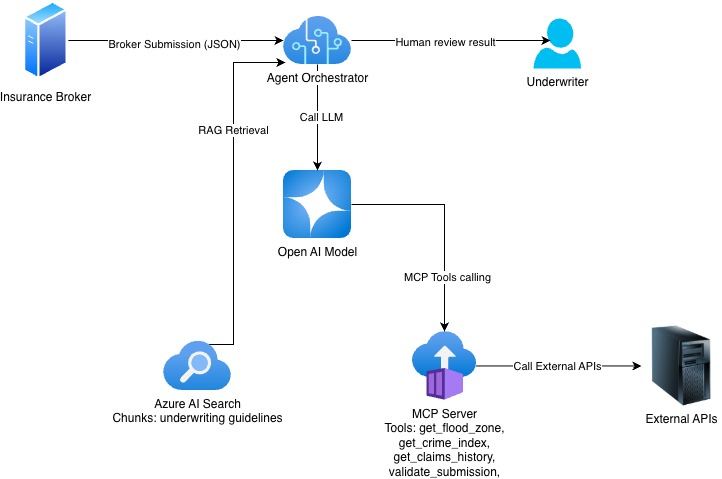

# 🏠 Underwriting Risk Assessment Agent


A production-grade agentic AI system for UK property insurance underwriting.
Built with **Microsoft Agent Framework**, **MCP (Model Context Protocol)**,
**Azure OpenAI**, and **Azure AI Search RAG**. Runs fully locally with Ollama
or in the cloud via Azure AI Foundry.

---

## Why this is a true agent — not a pipeline

> *"An LLM agent runs tools in a loop to achieve a goal."* — Simon Willison

Most LLM systems labelled "agents" are actually deterministic pipelines —
Python code calls LLM A, then LLM B, then LLM C in a fixed sequence.
The LLM only does text generation; Python controls the flow.

**This project is different. The LLM controls the flow.**

The agent receives a broker submission and a set of tools, then autonomously decides:
- Which tools to call and in what order
- Whether to call more tools based on what it finds
- When it has enough evidence to reach a decision

For a high-risk case (Zone 3b flood), the agent may call `get_flood_zone`,
immediately search guidelines for mandatory exclusions, and return **DECLINE**
— never bothering with crime or claims checks. For a borderline case it will
call all tools and still return **REFER**. A pipeline approach would always
run every step, regardless of the data.

---

## Architecture


```
Broker submission
      │
      ▼
┌─────────────────────────────────────────────────────┐
│  Azure AI Foundry — Implicit Agent Loop             │
│                                                     │
│  GPT-4o (GlobalStandard)                            │
│   ├── validate_submission()    ← MCP tool           │
│   ├── get_flood_zone()         ← MCP tool (EA API)  │
│   ├── get_crime_index()        ← MCP tool (Police API) │
│   ├── get_claims_history()     ← MCP tool           │
│   └── search_uw_guidelines()   ← Azure AI Search RAG│
│                                                     │
│  Loop: LLM → tool call → result → LLM → repeat     │
│  until LLM produces final JSON decision             │
└─────────────────────────────────────────────────────┘
      │
      ▼
{ decision: ACCEPT | REFER | DECLINE,
  confidence, rationale, risk_flags,
  flood_re_eligible, refer_reason,
  recommended_premium_loading }
      │
   REFER? → Human review queue (stub → Service Bus in production)
```

### MCP Server architecture

```
orchestrator.py (MCP client)
      │  streamable-http  http://127.0.0.1:8001/mcp
      ▼
mcp_servers/risk_server.py (FastMCP server)
      ├── validate_submission()     → business logic
      ├── get_flood_zone()          → Environment Agency flood API
      │                               + static Zone 3a/3b fallback layer
      ├── get_crime_index()         → data.police.uk street-level crime API
      │                               (calibrated multiplier, property crimes only)
      ├── get_claims_history()      → mock CUE database
      └── get_flight_schedule()     → intentionally irrelevant tool (see below)
```

---

## Tech stack

| Layer | Technology |
|---|---|
| Agent framework | Microsoft Agent Framework (`azure-ai-agents`) |
| LLM — cloud | Azure OpenAI GPT-4o (GlobalStandard) |
| LLM — local | Ollama `qwen2.5:14b` on GTX 1070 |
| Tool protocol | MCP — Model Context Protocol (FastMCP, streamable-http) |
| Knowledge base | Azure AI Search + RAG (UW guidelines) |
| Embeddings | Azure OpenAI `text-embedding-3-small` |
| External APIs | Environment Agency flood API, data.police.uk crime API |
| UI | Streamlit |
| Infrastructure | Terraform (azurerm provider) |
| Auth | Azure DefaultAzureCredential (Entra ID) |
| Language | Python 3.11 |

---

## Project structure

```
uw_risk_agent/
├── orchestrator.py              # Azure version — Microsoft Agent Framework loop
├── ollama_orchestrator.py       # Local version — Ollama + explicit agentic loop
├── app.py                       # Streamlit broker-facing UI
│
├── mcp_servers/
│   └── risk_server.py           # FastMCP server: 5 tools (4 real + 1 test)
│
├── models/
│   ├── submission.py            # UnderwritingSubmission dataclass
│   └── decision.py              # UnderwritingDecision dataclass + Decision enum
│
├── knowledge_base/
│   ├── uw_guidelines.md         # UK P&C underwriting guidelines document
│   └── ingest.py                # Chunk → embed → index into Azure AI Search
│
├── infra/                       # Terraform IaC
│   ├── main.tf                  # Azure resources
│   ├── variables.tf
│   ├── outputs.tf
│   └── terraform.tfvars.example
│
├── tests/                       # Test cases
├── .env.example
├── requirements.txt
└── README.md
```

---

## Running locally — no Azure account required

The Ollama version runs the full agentic loop on local hardware. Tested on:
- MacBook Pro (Intel, 16GB) — CPU inference, ~6 min per assessment
- Ubuntu PC with GTX 1070 (8GB VRAM) — GPU inference, ~2 min per assessment

### Prerequisites

```bash
# Install Ollama
brew install ollama          # macOS
# or: https://ollama.com/download for Linux/Windows

# Pull the model (4.7GB download for 14b, fits in 8GB VRAM)
ollama pull qwen2.5:14b

# Install Python dependencies
python -m venv .venv
source .venv/bin/activate
pip install -r requirements.txt
```

### Run locally

```bash
# Terminal 1 — start the MCP server (real EA + Police APIs)
python mcp_servers/risk_server.py

# Terminal 2 — run the local orchestrator
python ollama_orchestrator.py
```

To use a **remote Ollama** (e.g. GPU machine on your LAN), set in `.env`:

```
OLLAMA_HOST=http://192.168.2.250:11434
```

---

## Running on Azure

### 1. Provision infrastructure with Terraform

```bash
cd infra
cp terraform.tfvars.example terraform.tfvars
# Edit terraform.tfvars — add your subscription_id

terraform init
terraform plan
terraform apply
```

Provisions: Resource Group, OpenAI account (GPT-4o + embedding deployments),
AI Search, AI Foundry Hub + Project, Key Vault, Storage Account.

### 2. Configure environment

```bash
terraform output -raw env_file_block > ../.env
# Add AZURE_AI_PROJECT_ENDPOINT from Azure portal
# Add AZURE_SEARCH_CONNECTION_ID from Foundry portal
```

### 3. Index UW guidelines

```bash
python knowledge_base/ingest.py
# Output: "Ingest complete — 12 chunks indexed into 'uw-guidelines'"
```

### 4. Run

```bash
# Terminal 1
python mcp_servers/risk_server.py

# Terminal 2
python orchestrator.py

# Or launch the Streamlit UI
streamlit run app.py
```

---

## Example output

High-risk test case: BS1 4DJ, Bristol — timber frame 1912, 2 claims including
subsidence, Zone 3a flood area.

**Azure run (GPT-4o, 34 seconds):**

```
DECISION   : DECLINE
CONFIDENCE : HIGH
RATIONALE  : The property has timber construction dating to 1912 and is located
             in Flood Zone 3a, categorised as high flood risk. The combination
             of pre-1920 timber construction and Zone 3a flood is outside
             underwriting appetite and flagged as a mandatory exclusion.
FLAGS      : Flood Zone 3a, High flood risk, Timber pre-1920 construction
FLOOD RE   : No
TIME       : 33844ms
```

**Local run (qwen2.5:14b on GTX 1070, ~6 minutes):**

```
DECISION   : REFER
CONFIDENCE : HIGH
RATIONALE  : The property has a Zone 3a flood risk and timber frame
             construction built before 1920, both of which require referral.
             Additionally, the crime index is very high (81-100).
FLAGS      : TIMBER_PRE_1920_HIGH_RISK, ZONE_3A_FLOOD
FLOOD RE   : Yes
REFER NOTE : Timber frame construction, Zone 3a flood risk, very high crime band
TIME       : 346595ms
```

---

## Tool relevance discrimination test

The MCP server intentionally exposes a fifth tool — `get_flight_schedule()` —
which looks up airline schedules between airports. This has nothing to do with
property underwriting.

```python
@mcp.tool()
def get_flight_schedule(origin: str, destination: str, date: str) -> dict:
    """Returns available flight schedules between two airports on a given date.
    Use this to look up flight times for travel planning."""
    ...
```

**Result:** In every test run, the agent loaded all 5 tool schemas,
read their docstrings, and called only the 4 relevant underwriting tools.
`get_flight_schedule` was never called.

This demonstrates that the LLM correctly discriminates between available
and appropriate tools based on goal context — a key requirement for
production agentic systems with large tool catalogues.

---

## MCP concepts demonstrated

| Concept | Implementation |
|---|---|
| Transport | Streamable HTTP (`/mcp` path) — production standard |
| Protocol | JSON-RPC 2.0 — request / response / notification |
| Primitives | Tools (all 5) + Resources (guidelines sections) |
| Tool relevance | LLM ignores irrelevant `get_flight_schedule` tool |
| Security | System prompt hardening against prompt injection |
| Inspection | FastMCP Inspector compatible |

---

## Real UK government APIs used

**Environment Agency Flood API**
- `https://environment.data.gov.uk/flood-monitoring/api/floodAreas`
- Returns active flood warnings within 5km of a postcode
- Limitation: only returns active warnings — dry weather = Zone 1
- Solution: static fallback layer for known high-risk postcodes (Zone 3a/3b)

**data.police.uk Crime API**
- `https://data.police.uk/api/crimes-street/all-crime`
- Returns street-level crime for a lat/lng over the last 3 months
- Filters to property crime categories only: burglary, vehicle crime,
  theft, robbery, shoplifting, criminal damage/arson
- Calibrated index: monthly average × 1.0, normalised 0–100

---

## Agentic patterns

This project demonstrates all four main agentic patterns:

| Pattern | Example |
|---|---|
| **Pattern 1 — LLM as router** | FAQ chatbot (genai_faq_chatbot project) |
| **Pattern 2 — LLM as pipeline step** | v1 orchestrator (replaced) |
| **Pattern 3 — Autonomous agent loop** | This project ✓ |
| **Pattern 4 — Multi-agent** | Future: flood + claims + compliance specialists |

---

## Key design decisions

**Why MCP over direct function calling?**
Tools are defined once in `risk_server.py` and shared across any MCP-compatible
host — Microsoft Agent Framework, LangChain, Claude Desktop, or any future
framework — without code changes. Adding a new tool means updating the server
only, not every consumer.

**Why inline guidelines for local / RAG for cloud?**
`qwen2.5:14b` on 8GB VRAM has a practical 32k context window. With inline
guidelines (~2k tokens) the model reasons about the full ruleset without
retrieval latency. GPT-4o with RAG uses semantic search to retrieve relevant
guideline sections, reducing input tokens per call.

**Why GlobalStandard deployment type?**
Azure OpenAI GlobalStandard routes inference to any available global data
centre, giving 450 TPM quota vs 50 TPM for Standard regional deployment.
For a portfolio project without data residency constraints this is the
practical choice.

---

## Infrastructure

All Azure resources managed by Terraform (`infra/`):

- `azurerm_resource_group` — UK South
- `azurerm_cognitive_account` — Azure OpenAI (GPT-4o + text-embedding-3-small)
- `azurerm_search_service` — AI Search (Free tier for development)
- `azurerm_ai_foundry` — AI Foundry Hub
- `azurerm_ai_foundry_project` — AI Foundry Project
- `azurerm_storage_account` — required by Foundry Hub
- `azurerm_key_vault` — required by Foundry Hub

---

## Related project

[**genai_faq_chatbot**](https://github.com/samueltin/genai_faq_chatbot) —
A production-ready RAG-based FAQ assistant using LangChain, Azure AI Search,
Azure OpenAI, Streamlit, and Terraform IaC. Pattern 1 (LLM as router) to
this project's Pattern 3 (autonomous agent).

---

## Author

**Samuel Tin (Chi Hang Tin)**
Enterprise AI Solution Architect | 21+ years in insurance and banking technology

[](https://www.linkedin.com/in/chi-hang-tin/)
[](https://github.com/samueltin)

Certifications: Microsoft Azure AI Engineer Associate (AI-102),
Azure Administrator Associate (AZ-104)
