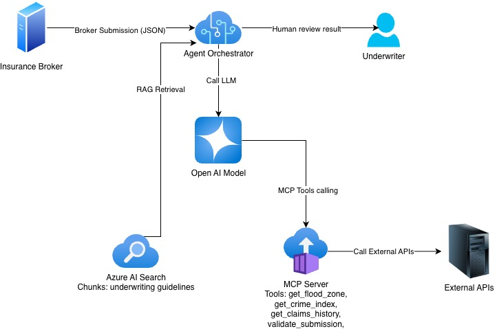

# 🏠 Underwriting Risk Assessment Agent


A production-grade agentic AI system for UK property insurance underwriting.
Built with **Microsoft Agent Framework**, **MCP (Model Context Protocol)**,
**Azure OpenAI**, and **Azure AI Search RAG**, served over **FastAPI**.
Runs fully locally with Ollama or against Azure OpenAI.

The agent loop runs **in the API process**, not in a hosted service, so the
MCP connection is client-side and a `localhost` MCP server works without a
tunnel or public endpoint.

---

## Why this is a true agent — not a pipeline

> *"An LLM agent runs tools in a loop to achieve a goal."* — Simon Willison

Most LLM systems labelled "agents" are actually deterministic pipelines —
Python code calls LLM A, then LLM B, then LLM C in a fixed sequence.
The LLM only does text generation; Python controls the flow.

**This project is different. The LLM controls the flow.**

The agent receives a broker submission and a set of tools, then autonomously decides:
- Which tools to call and in what order
- Whether to call more tools based on what it finds
- When it has enough evidence to reach a decision

For a high-risk case (Zone 3b flood), the agent may call `get_flood_zone`,
immediately search guidelines for mandatory exclusions, and return **DECLINE**
— never bothering with crime or claims checks. For a borderline case it will
call all tools and still return **REFER**. A pipeline approach would always
run every step, regardless of the data.

**Caveat, stated honestly:** this applies to the Azure provider. The local
Ollama path is a deterministic pipeline — `llama3.1:8b` is not reliable
enough over a multi-turn tool loop, so the tools are called in code and the
model is asked once for the decision. See *Key design decisions*.

---

## Architecture


```
Broker submission
      │
      ▼
┌──────────────────────────────────────────────────────────┐
│  Agent loop — runs in the API process (MAF)              │
│                                                          │
│  Azure gpt-4.1  or  Ollama llama3.1:8b                   │
│   ├── validate_submission()          ← MCP tool          │
│   ├── get_flood_zone()               ← MCP tool (EA API) │
│   ├── get_crime_index()              ← MCP tool (Police) │
│   ├── get_claims_history()           ← MCP tool          │
│   ├── get_property_sale_history()    ← MCP tool (Land Reg)│
│   └── search_uw_guidelines()         ← Azure AI Search RAG│
│                                                          │
│  Loop: LLM → tool call → result → LLM → repeat           │
│  until LLM produces final JSON decision                  │
└──────────────────────────────────────────────────────────┘
      │
      ▼
{ decision: ACCEPT | REFER | DECLINE,
  confidence, rationale, risk_flags,
  flood_re_eligible, refer_reason,
  recommended_premium_loading }
      │
   Every decision → Azure Storage Queue (accept / refer / decline)
   REFER?          → also logged to the human review handler
```

### MCP Server architecture

```
api/orchestrator.py (MCP client)
      │  streamable-http  http://127.0.0.1:8001/mcp
      ▼
mcp_servers/risk_server_v4.py (FastMCP server)
      ├── validate_submission()           → business logic
      ├── get_flood_zone()                → Environment Agency flood API
      │                                     + static Zone 3a/3b fallback layer
      ├── get_crime_index()               → data.police.uk street-level crime API
      │                                     (property crimes only; reports a
      │                                     multiple of the London median, and
      │                                     DATA_UNAVAILABLE where a force
      │                                     publishes nothing)
      ├── get_claims_history()            → mock CUE database
      └── get_property_sale_history()     → HM Land Registry Price Paid
                                            (sum-insured plausibility check)
```

---

## Tech stack

| Layer | Technology |
|---|---|
| Agent framework | Microsoft Agent Framework (`agent-framework`) |
| API | FastAPI + Uvicorn |
| LLM — cloud | Azure OpenAI `gpt-4.1` (GlobalStandard) |
| LLM — local | Ollama `llama3.1:8b` on GTX 1070 |
| Tool protocol | MCP — Model Context Protocol (FastMCP, streamable-http) |
| Knowledge base | Azure AI Search + RAG (UW guidelines) |
| Embeddings | Azure OpenAI `text-embedding-3-small` |
| External APIs | Environment Agency flood, data.police.uk crime, HM Land Registry Price Paid |
| Decision dispatch | Azure Storage Queues (accept / refer / decline) |
| UI | Streamlit |
| Infrastructure | Terraform (azurerm provider) |
| Auth | Azure DefaultAzureCredential (Entra ID) |
| Language | Python 3.11 |

---

## Project structure

```
uw_risk_agent/
├── api/
│   ├── main.py                         # FastAPI service
│   ├── orchestrator.py                 # Active orchestrator: Azure GPT-4.1 or Ollama
│   ├── orchestrator_legacy.py          # Legacy Foundry Agent Service version
│   └── ollama_orchestrator_legacy.py   # Legacy Ollama explicit-loop version
├── app.py                       # Streamlit broker-facing UI
│
├── mcp_servers/
│   └── risk_server_v4.py        # FastMCP server: 5 underwriting tools
│
├── models/
│   ├── submission.py            # UnderwritingSubmission dataclass
│   └── decision.py              # UnderwritingDecision dataclass + Decision enum
│
├── knowledge_base/
│   ├── uw_guidelines.md         # UK P&C underwriting guidelines document
│   └── ingest.py                # Chunk → embed → index into Azure AI Search
│
├── monitor/
│   └── telemetry.py             # App Insights / OpenTelemetry helpers
│
├── infra/
│   ├── terraform/               # Terraform IaC
│   └── bicep/                   # Bicep alternative
│
├── tests/                       # Test cases
├── env.example
├── requirements.txt
└── README.md
```

---

## API

| Endpoint | Purpose |
|---|---|
| `POST /assess` | Full assessment — tools plus LLM interpretation (~15–40s) |
| `POST /findings` | MCP risk tools only, no LLM (a few seconds) |
| `GET /health` | Liveness plus the configured provider and model |

Interactive docs at `http://127.0.0.1:8010/docs`.

Which LLM runs is fixed by `UW_LLM_PROVIDER` in `.env` (`azure` or `ollama`).
It is a deployment decision: clients send insurance data only and cannot
select an engine. Changing it requires an API restart.

The **New Assessment** page uses both endpoints in sequence, and shows them
as two sections:

1. **Findings** — calibrated data from the risk tools, with no
   interpretation. This is what a conventional system can produce on its own.
2. **AI interpretation** — the agent's decision, rationale and risk flags,
   weighed against the underwriting guidelines.

---

## Running locally — no Azure account required

The Ollama version runs the full agentic loop on local hardware. Tested on:
- MacBook Pro (Intel, 16GB) — CPU inference, ~6 min per assessment
- Ubuntu PC with GTX 1070 (8GB VRAM) — GPU inference, ~2 min per assessment

### Prerequisites

```bash
# Install Ollama
brew install ollama          # macOS
# or: https://ollama.com/download for Linux/Windows

# Pull the model (4.9GB, fits in 8GB VRAM)
ollama pull llama3.1:8b

# Install Python dependencies
python -m venv .venv
source .venv/bin/activate
pip install -r requirements.txt
```

### Run locally

```bash
# Terminal 1 — start the MCP server (real EA + Police + Land Registry APIs)
python mcp_servers/risk_server_v4.py

# Terminal 2 — run the API with UW_LLM_PROVIDER=ollama
uvicorn api.main:app --port 8010 --reload

# Terminal 3 — the UI (talks to the API over HTTP; it imports no agent code)
streamlit run app.py
```

To use a **remote Ollama** (e.g. GPU machine on your LAN), set in `.env`:

```
OLLAMA_HOST=http://192.168.2.250:11434
OLLAMA_MODEL=llama3.1:8b
```

### Environment variables

| Variable | Purpose |
|---|---|
| `UW_LLM_PROVIDER` | `azure` or `ollama` — which LLM drives the agent |
| `OLLAMA_HOST` / `OLLAMA_MODEL` | Local provider target |
| `AZURE_OPENAI_MODEL` | Cloud deployment name (default `gpt-4.1`) |
| `MCP_RISK_SERVER_URL` | MCP server, default `http://127.0.0.1:8001/mcp` |
| `UW_API_URL` | Where the Streamlit UI finds the API (default `:8010`) |
| `AZURE_STORAGE_ACCOUNT_NAME` | Storage account holding the decision queues |
| `MOCK_DECISION` | `true` returns a random decision without calling an LLM |

To test API responses and decision queue routing without calling an LLM, set:

```
MOCK_DECISION=true
```

Each assessment then returns a random `ACCEPT`, `DECLINE`, or `REFER` decision.
The normal queue dispatch and human-review handling still run. Restart FastAPI
after changing the flag.

The Streamlit UI has two pages in its sidebar: **New Assessment** and
**Case Review**. The review page presents the visible ACCEPT, DECLINE, and REFER
records as underwriting cases, with applicant, property, coverage, claims, risk
flags, and rationale. It peeks at up to 32 messages from each configured Azure
Storage queue without consuming them. It uses `AZURE_STORAGE_CONNECTION_STRING`
when set, otherwise `DefaultAzureCredential` with
`AZURE_STORAGE_ACCOUNT_NAME`.

---

## Running on Azure

### 1. Provision infrastructure with Terraform

```bash
cd infra
cp terraform.tfvars.example terraform.tfvars
# Edit terraform.tfvars — add your subscription_id

terraform init
terraform plan
terraform apply
```

Provisions: Resource Group, OpenAI account (`gpt-4.1` + embedding deployments),
AI Search, AI Foundry Hub + Project, Key Vault, Storage Account.

### 2. Configure environment

```bash
terraform output -raw env_file_block > ../.env
# Add AZURE_AI_PROJECT_ENDPOINT from Azure portal
# Add AZURE_SEARCH_CONNECTION_ID from Foundry portal
```

### 3. Index UW guidelines

```bash
python knowledge_base/ingest.py
# Output: "Ingest complete — 12 chunks indexed into 'uw-guidelines'"
```

### 4. Run

```bash
# Terminal 1
python mcp_servers/risk_server_v4.py

# Terminal 2
uvicorn api.main:app --port 8010 --reload

# Terminal 3
streamlit run app.py
```

---

## Example output

High-risk test case: BS1 4DJ, Bristol — timber frame 1912, 2 claims including
subsidence, Zone 3a flood area.

**Azure run (`gpt-4.1`, ~30-40 seconds):**

```
DECISION   : DECLINE
CONFIDENCE : HIGH
RATIONALE  : The property has timber construction dating to 1912 and is located
             in Flood Zone 3a, categorised as high flood risk. The combination
             of pre-1920 timber construction and Zone 3a flood is outside
             underwriting appetite and flagged as a mandatory exclusion.
FLAGS      : TIMBER_PRE_1920_HIGH_RISK, ZONE_3A_HIGH_FLOOD,
             VERY_HIGH_PROPERTY_CRIME
FLOOD RE   : Yes
TIME       : 41655ms
```

**Local run (`llama3.1:8b` on GTX 1070):**

The local path calls the MCP tools in code, then asks the model once for the
decision under a JSON schema constraint. Typical wall-clock is well under a
minute — most of it the single decision call, since the tool calls are
deterministic and run concurrently with no model round-trips.

---

## MCP concepts demonstrated

| Concept | Implementation |
|---|---|
| Transport | Streamable HTTP (`/mcp` path) — production standard |
| Protocol | JSON-RPC 2.0 — request / response / notification |
| Primitives | Tools (5 underwriting tools) + Resources (guidelines sections) |
| Client-side connector | Agent loop runs in-process, so a localhost MCP server works |
| Security | System prompt hardening against prompt injection |
| Inspection | FastMCP Inspector compatible |

---

## Real UK government APIs used

**Environment Agency Flood API**
- `https://environment.data.gov.uk/flood-monitoring/api/floodAreas`
- Returns active flood warnings within 5km of a postcode
- Limitation: only returns active warnings — dry weather = Zone 1
- Solution: static fallback layer for known high-risk postcodes (Zone 3a/3b)

**data.police.uk Crime API**
- `https://data.police.uk/api/crimes-street/all-crime`
- Returns street-level crime within roughly a 1 mile radius of a lat/lng,
  one calendar month per request
- Filters to property crime categories only: burglary, vehicle crime,
  theft, robbery, shoplifting, criminal damage/arson
- Reported as a multiple of the median London postcode, which reads more
  plainly than a 0–100 index — the index saturates at 100 for any urban
  postcode, so Bristol and central London both score 100
- Queries months 2–4 back. The most recent month or two are not published
  for **any** force, and the API returns HTTP 200 with an empty list rather
  than an error — counting those as crime-free months understated every
  average by roughly a third
- Limitation: some forces (notably Greater Manchester) no longer publish to
  data.police.uk. An empty response is indistinguishable from a genuinely
  quiet area
- Solution: quiet areas trigger a force-publication check; where the force
  publishes nothing the tool returns `DATA_UNAVAILABLE` so the case refers
  rather than passing as low risk

### How the crime baseline was derived

`LONDON_MEDIAN_MONTHLY_PROPERTY_CRIMES = 277` in
[`mcp_servers/risk_server_v4.py`](mcp_servers/risk_server_v4.py) is measured,
not estimated.

**Method** — identical to what the tool itself does, so the ratio compares
like with like:

1. Draw postcodes at random from `api.postcodes.io/random/postcodes` and keep
   those whose `region` is `London`, until 100 are collected. Drawing at
   random rather than choosing places by hand keeps the sample free of
   selection bias.
2. For each postcode, query `crimes-street/all-crime` for **2026-05, 2026-06
   and 2026-07** — three months known to be published.
3. Count only property crime categories, and take the mean across the three
   months.
4. Take the median across the 100 postcodes.

All 100 postcodes returned usable data; none were excluded. The Metropolitan
and City of London forces both publish, so an empty month inside London is a
genuine zero rather than missing data.

**Distribution** (property crimes per month within ~1 mile):

| min | p10 | p25 | median | p75 | p90 | max |
|---|---|---|---|---|---|---|
| 13.7 | 56 | 112 | **277** | 620 | 1459 | 3182 |

The distribution is heavily right-skewed — mean 560 against a median of 277 —
so the median is the centre, not the mean.

**Scope caveat:** the baseline is London. A national figure was attempted and
abandoned: most UK postcodes are rural, which pulled the median so low that
every urban property read as an enormous multiple of it. Comparing a
non-London property against this baseline overstates how unusual it is.

**HM Land Registry Price Paid**
- `https://landregistry.data.gov.uk/data/ppi/transaction-record.json`
- Historic sale prices by postcode; no API key required
- Used to sanity-check the sum insured at submission stage
- Buildings cover is rebuild cost and excludes land, so a sum insured below
  the sale price is normal — only ≥2.5x (overinsurance) or ≤0.25x
  (underinsurance) is flagged
- A postcode holds many properties at different values, so the check only
  runs when a house number identifies the subject property

---

## Agentic patterns

This project demonstrates all four main agentic patterns:

| Pattern | Example |
|---|---|
| **Pattern 1 — LLM as router** | FAQ chatbot (genai_faq_chatbot project) |
| **Pattern 2 — LLM as pipeline step** | v1 orchestrator (replaced) |
| **Pattern 3 — Autonomous agent loop** | This project ✓ |
| **Pattern 4 — Multi-agent** | Future: flood + claims + compliance specialists |

---

## Key design decisions

**Why MCP over direct function calling?**
Tools are defined once in `risk_server_v4.py` and shared across any MCP-compatible
host — Microsoft Agent Framework, LangChain, Claude Desktop, or any future
framework — without code changes. Adding a new tool means updating the server
only, not every consumer.

**Why inline guidelines for local / RAG for cloud?**
`llama3.1:8b` on 8GB VRAM has a practical context window in the low tens of
thousands of tokens. With inline guidelines (~2k tokens) the model reasons
about the full ruleset without retrieval latency. `gpt-4.1` with RAG uses
semantic search to retrieve relevant guideline sections, reducing input
tokens per call.

**Why does the local provider not use the agent loop?**
`llama3.1:8b` handles a single constrained JSON response well, but drifts
over a multi-turn tool-calling loop — it narrates instead of emitting the
decision, and every run falls back to REFER. So the Ollama path calls the
MCP tools deterministically in code, then asks the model once for the
decision with `format="json"`. The Azure path keeps the real agent loop.

**Why GlobalStandard deployment type?**
Azure OpenAI GlobalStandard routes inference to any available global data
centre, giving far higher throughput quota than a Standard regional
deployment.
For a portfolio project without data residency constraints this is the
practical choice.

---

## Infrastructure

All Azure resources managed by Terraform (`infra/terraform/`), with a Bicep
alternative in `infra/bicep/`:

- `azurerm_resource_group` — UK South
- `azurerm_cognitive_account` — Azure OpenAI (`gpt-4.1` + `text-embedding-3-small`)
- `azurerm_search_service` — AI Search (Free tier for development)
- `azurerm_ai_foundry` — AI Foundry Hub
- `azurerm_ai_foundry_project` — AI Foundry Project
- `azurerm_storage_account` — required by Foundry Hub; also hosts the
  decision queues (`uw-decisions-accept` / `-refer` / `-decline`)
- `azurerm_key_vault` — required by Foundry Hub

Queue writes use `DefaultAzureCredential`, which needs the **Storage Queue
Data Contributor** role on the storage account. `Owner` alone is not
sufficient — it grants management access, not data-plane access.

---

## Related project

[**genai_faq_chatbot**](https://github.com/samueltin/genai_faq_chatbot) —
A production-ready RAG-based FAQ assistant using LangChain, Azure AI Search,
Azure OpenAI, Streamlit, and Terraform IaC. Pattern 1 (LLM as router) to
this project's Pattern 3 (autonomous agent).

---

## Author

**Samuel Tin (Chi Hang Tin)**
Enterprise AI Solution Architect | 21+ years in insurance and banking technology

[](https://www.linkedin.com/in/chi-hang-tin/)
[](https://github.com/samueltin)

Certifications: Microsoft Azure AI Engineer Associate (AI-102),
Azure Administrator Associate (AZ-104)
